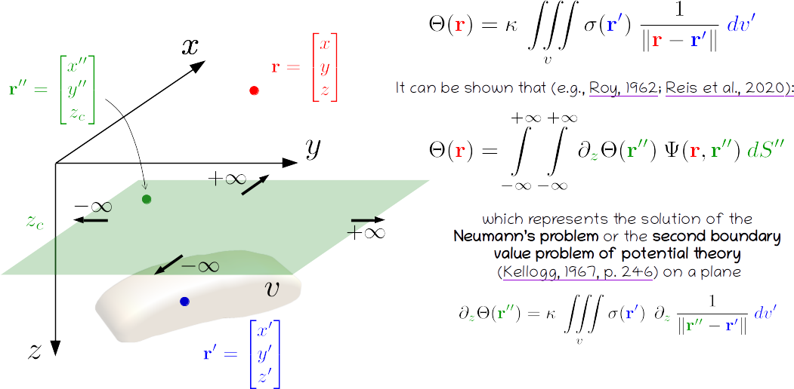

# Processing and interpreting potential-field data via Equivalent-Layer Technique

[*by Vanderlei C. Oliveira Jr.*](https://www.pinga-lab.org/people/oliveira-jr.html)

This is an invited presentation for the [Geo-Kolloquium](https://tu-freiberg.de/geo-kolloquium)
of the TU Bergakademie Freiberg, Germany. The presentation is
focused on the theoretical aspects supporting the potential-field
transformations usually performed via equivalent layer.

*An archived version of this repo can be found at:* https://doi.org/10.6084/m9.figshare.19158554.v1

## License

All slides are made available under a [CC-BY-4.0](https://choosealicense.com/licenses/cc-by-4.0/) license. You can freely
use and modify them, without warranty, so long as you provide attribution
to the author. See `LICENSE.md` for the full license text.
